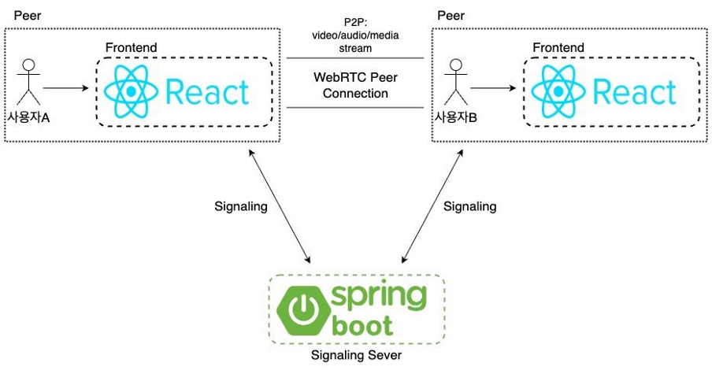
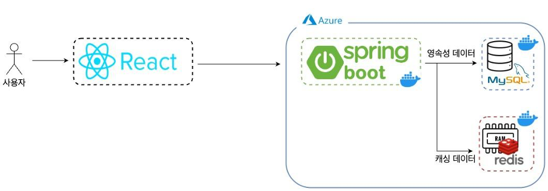
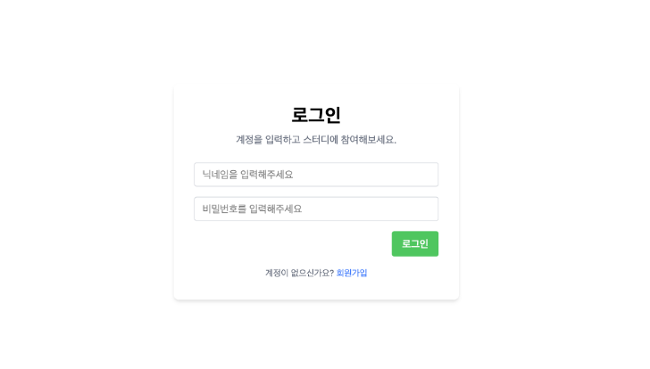
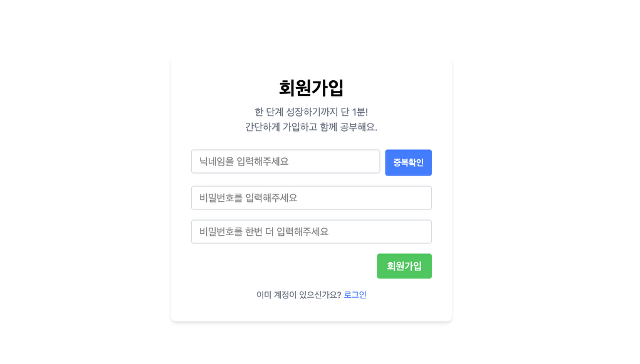
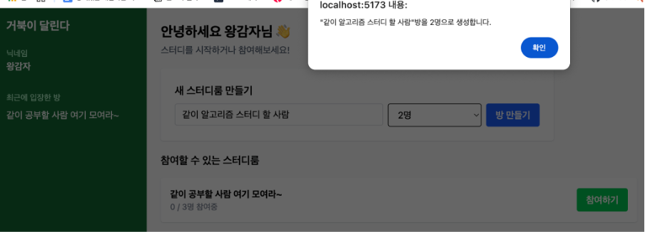
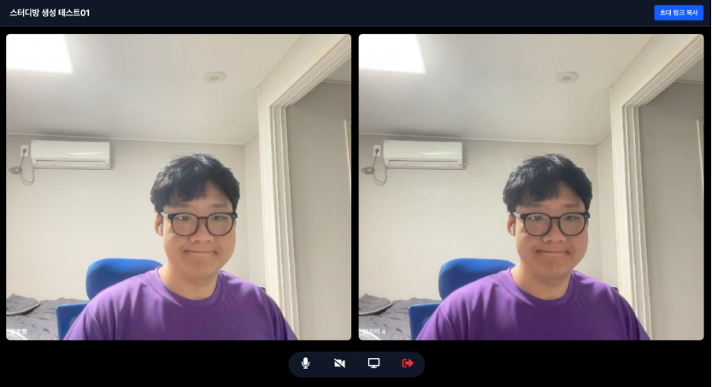

# 온라인 스터디 카페 - WebRTC 기반 실시간 화상 회의 플랫폼
WebRTC 기술을 활용하여 **N:M 실시간 화상 회의**가 가능한 온라인 스터디 플랫폼을 구현한 개인 프로젝트 입니다. JWT 기반의 사용자 인증, 스터디 방 생성, 실시간 웹 캠 공유, 화면 공유, 마이크, 캠 On/Off를 할 수 있습니다.

## 프로젝트 개요
- 개발 기간 : 2025.05 ~ 2025.06
- 개인 프로젝트

## 기술 스택
**Frontend**
- React (Vite)
- Redux ToolKit
- Tailwind CSS
- Sock JS
- WebRTC

**Backend**
- Spring Boot
- Spring Security
- JPA
- MySQL
- Redis
- STOMP
- WebSocket

**Infrastructure**
- Docker + Docker Compose
- Azure VM

## 주요 기능
- JWT 기반 사용자 인증
- 스터디 방 생성, 입장, 퇴장 기능
- WebRTC 기반 실시간 화상 회의 (N:M 구조)
- WebSocket 기반 실시간 시그널링 서버
- Redis를 활용한 실시간 접속자 수 관리
- Docker Compose를 이용한 서버 컨테이너 화
- Microsoft Azure VM을 통환 배포 환경 구성

## 시스템 흐름 및 구성도
### WebRTC 연결 흐름

사용자는 브라우저(React)를 통해 방에 입장을 하고, 시그널링 서버(SpringBoot)를 통해 offer/answer/ICE candidate를 메시지를 교환하여 P2P WebRTC 연결을 합니다. 이후, 미디어 스트림은 서버를 거치지 않고 peer 간 전송합니다.

### 시스템 구성도

백엔드 인스턴스들은 Microsoft Azure VM 인스턴스 안에 Docker Compose로 구동되며 SpringBoot, MySQL, Redis를 컨테이너 단위로 구성하였고, React는 로컬에서 구동되고 있습니다.

## 시연 이미지
- 로그인 및 회원가입

- 방 생성 및 입장

- WebRTC 연결 이후 화상 회의

## 회고
- **배운 점**
    - WebRTC의 핵심 개념인 offer/answer/candidate의 흐름을 구현해보면서 WebRTC에 대하여 더 깊은 이해를 할 수 있었음
- **아쉬운 점**
    - WebRTC를 처음 사용해봐서 React 컴포넌트를 명확하게 역할 별로 모듈화 하지 못한 점

## 향후 계획
- 중간 미디어 서버를 구현하거나 추가 -> 다수 참여자 성능을 개선
- WebRTC TURN 서버 구성 실습 및 클라우드 확장 실험

